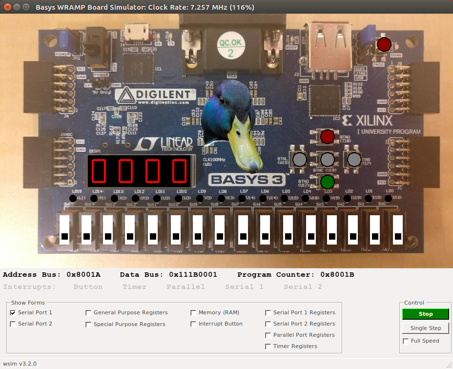

# Multi-Tasking Kernel
This has been programmed in wramp assembly language (used by the University of Waikato) and C.  
This multi-tasking kernel contains 4 tasks that it can perform saving and loading the context of each one within the dispatcher and a scheduler to determine the next task.

### Wramp Manual
For more information on how wramp works click [here](https://wramp.wand.nz/book.html) for the manual.

### Wramp Board

### Notes
- kernel_q9 is the finalised version while the kernel_q* are build ups of what kernel_q9 is.
- Serial and parallel tasks display values to a SSD screen on the wramp board.
- Does not contain commit history as I am in the process of adding pre-existing projects to my github.